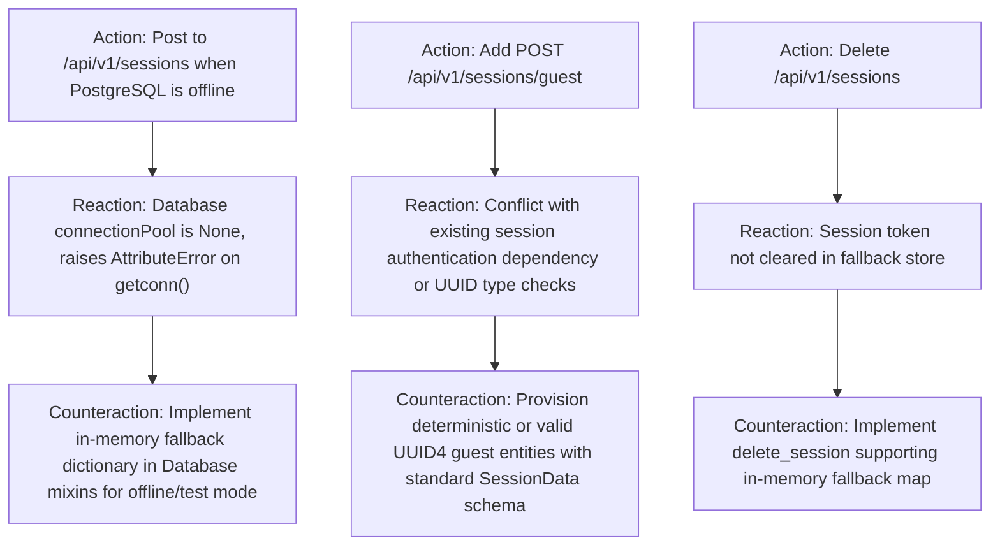

# ARC Probing — Mission AUTH-1: Resilient Backend Session Engine & Local Guest Authentication

**Mission:** `AUTH-1`  
**Governing Authority:** `DATA-MODEL-AUTHORITY.md`  
**Required Evidence Stage:** `CANONICAL`  
**Assigned Lane:** `lane_backend_auth`  

---

## 1. Forensic Intake & Claim Framing

### 1.1 Claims Under Test
* **Claim C1 (Offline / Dev Fallback Resilience):** When PostgreSQL is offline or uninitialized (`connectionPool is None`), `/api/v1/sessions` and user authentication functions fall back to an in-memory session and user registry instead of raising unhandled `AttributeError` and returning HTTP 500.
* **Claim C2 (Instant Guest Authentication Endpoint):** The server exposes `POST /api/v1/sessions/guest`, which generates an authenticated guest session token (`token` UUID) and guest user owner UUID with a starting pot of $15,000 (1,500,000 cents), enabling zero-friction onboarding.
* **Claim C3 (Authentication Dependency Integrity):** The FastAPI `authenticate` dependency (`Header: Authorization: Bearer <token>`) verifies tokens emitted by both PostgreSQL and in-memory fallback stores, raising HTTP 401 when the token is missing or expired.
* **Claim C4 (Backward Compatibility & Invariant Preservation):** Existing password verification (`User.verify_password`) and JSON response schemas (`SessionResponse`) remain 100% backward compatible without breaking legacy paper trading endpoints.

---

## 2. Action–Reaction–Counteraction (ARC) Analysis

---

## 3. Harness Fidelity & Verification Controls

### 3.1 Positive Control (Credential & Guest Auth Flow)
* Probe: Run `test_sessions.py` with:
  1. `POST /api/v1/sessions/guest` returns HTTP 200 with valid `owner` and `token` UUIDs.
  2. `DELETE /api/v1/sessions` with `Bearer <token>` removes the session and returns HTTP 200.
  3. `POST /api/v1/sessions` with valid credentials authenticates successfully in fallback mode.

### 3.2 Negative Control (Invalid Credentials & Unauthorized Access)
* Probe:
  1. `POST /api/v1/sessions` with non-existent user returns HTTP 404 (Not Found).
  2. `POST /api/v1/sessions` with wrong password returns HTTP 403 (Forbidden).
  3. Protected route request with invalid Bearer token returns HTTP 401 (Unauthorized).

---

## 4. Rollback & Pre-conditions
* **Pre-conditions:** `CLEAN-4` completed at `4fc23e1`.
* **Rollback Plan:** `git checkout -- packages/server/src/routes/api/v1/sessions.py packages/server/src/services/database/`
* **Point of No Return:** None.
