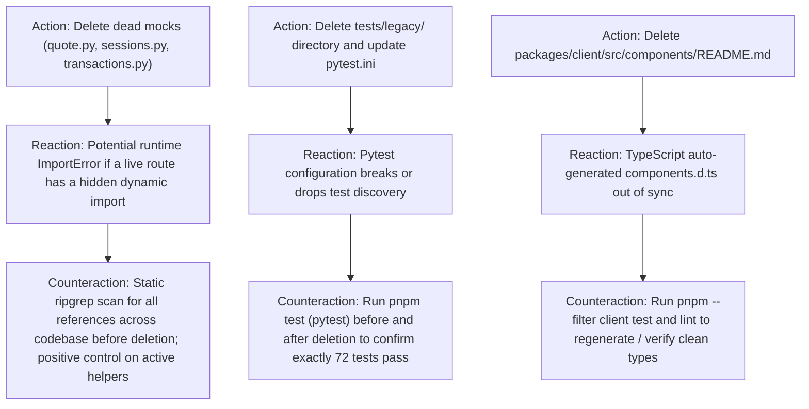

# ARC Probing — Mission CLEAN-1: Dead Code Elimination & Test Suite Hygiene

**Mission:** `CLEAN-1`  
**Governing Authority:** `DATA-MODEL-AUTHORITY.md`  
**Required Evidence Stage:** `CANONICAL`  
**Assigned Lane:** `lane_cleanup`  

---

## 1. Forensic Intake & Claim Framing

### 1.1 Claims Under Test
* **Claim C1 (Dead Helper Mocks):** `packages/server/src/helpers/quote.py`, `sessions.py`, and `transactions.py` are dead class-project mocks. No active endpoint in `src/routes/` or service in `src/services/` imports them. Deleting them will cause zero regressions.
* **Claim C2 (Active Helper Invariants):** `packages/server/src/helpers/user.py`, `portfolio.py`, and `tournament.py` are actively imported by `routes/api/v1/users.py`, `portfolios.py`, and `tournaments.py` for input validation. They must NOT be deleted.
* **Claim C3 (Obsolete Legacy Tests):** `packages/server/tests/legacy/` contains 4 `.legacy.py` files that are explicitly excluded from `pytest.ini` (`norecursedirs = legacy`), unmaintained, and make unauthorized external Alpaca requests. Deleting this entire folder eliminates test debt without affecting the 72 passing server tests.
* **Claim C4 (Template README Pollution):** `packages/client/src/components/README.md` is actively parsed by Vite's `unplugin-vue-components` / markdown plugin into a global Vue component `README`. Deleting it and other 1-line boilerplate READMEs across client and server subdirectories cleans the project without removing any real documentation.

---

## 2. Action–Reaction–Counteraction (ARC) Analysis

---

## 3. Harness Fidelity & Verification Controls

### 3.1 Positive Control (Active Helper Retention)
* Probe: Search for `helpers.user` in `packages/server/src/routes/api/v1/users.py`.
* Expected: Matches `from helpers.user import User`.
* Control Result: Confirms active helpers are distinguishable from dead helpers.

### 3.2 Negative Control (Dead Helper Reference Absence)
* Probe: Search for `helpers.quote` across all files in `packages/server/src/routes/` and `src/services/`.
* Expected: 0 matches.
* Control Result: Proves `quote.py` is unreferenced in production code paths.

---

## 4. Rollback & Pre-conditions
* **Pre-conditions:** All 110 monorepo tests pass; working tree clean or tracked in Git.
* **Rollback Plan:** `git checkout -- packages/server/ packages/client/ docs/`
* **Point of No Return:** File deletions (tracked in Git commit).
