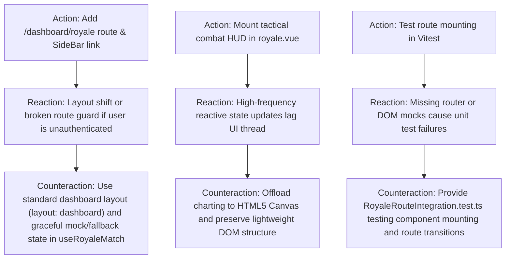

# ARC Probing — Mission CLEAN-2: Stock Royale Client Route & Navigation Integration

**Mission:** `CLEAN-2`  
**Governing Authority:** `DATA-MODEL-AUTHORITY.md`  
**Required Evidence Stage:** `ACTIVATION`  
**Assigned Lane:** `lane_tactical_ui`  

---

## 1. Forensic Intake & Claim Framing

### 1.1 Claims Under Test
* **Claim C1 (Route Accessibility):** Creating `packages/client/src/pages/dashboard/royale.vue` automatically registers `/dashboard/royale` in `vite-plugin-pages` / Vue Router.
* **Claim C2 (Sidebar Navigation):** Adding the Stock Royale entry to `packages/client/src/components/navigation/SideBar.vue` with `Crosshair` icon from `@vicons/tabler` exposes the route to end users cleanly without layout regression.
* **Claim C3 (Tactical Component Composition):** `royale.vue` seamlessly binds `MarketRadarMap.vue`, `TradingDuelArena.vue`, `KillFeed.vue`, `MatchVictoryModal.vue`, and `useRoyaleMatch.ts`, supporting full lifecycle from lobby matchmaking to active combat, spectator mode, and post-match victory celebration.

---

## 2. Action–Reaction–Counteraction (ARC) Analysis

---

## 3. Harness Fidelity & Verification Controls

### 3.1 Positive Control (Component Mount Verification)
* Probe: Mount `royale.vue` in Vitest and assert radar canvas, lobby card, and kill feed exist.
* Expected: DOM elements render successfully with test props.

### 3.2 Negative Control (Invalid Match State Resilience)
* Probe: Mount `royale.vue` with empty state; verify no unhandled null pointer exceptions occur.

---

## 4. Rollback & Pre-conditions
* **Pre-conditions:** `CLEAN-1` completed at `8d11f84`; all 110 tests pass.
* **Rollback Plan:** `git checkout -- packages/client/`
* **Point of No Return:** None (additive client code).
