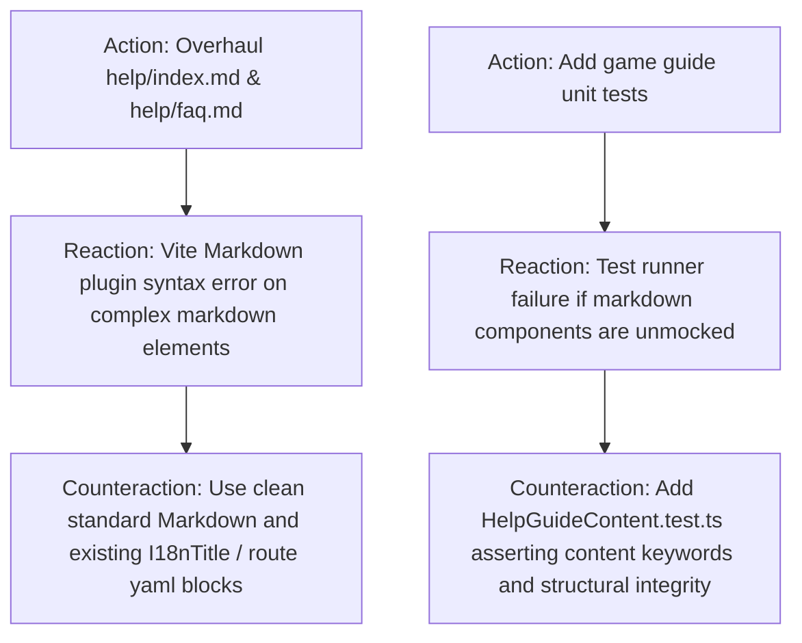

# ARC Probing — Mission CLEAN-3: Comprehensive In-App Game Manual & Interactive Help Overhaul

**Mission:** `CLEAN-3`  
**Governing Authority:** `DATA-MODEL-AUTHORITY.md`  
**Required Evidence Stage:** `CANONICAL`  
**Assigned Lane:** `lane_tactical_ui`  

---

## 1. Forensic Intake & Claim Framing

### 1.1 Claims Under Test
* **Claim C1 (Markdown Help Route Rendering):** Overhauling `packages/client/src/pages/dashboard/help/index.md` and `faq.md` preserves the `dashboard-md` layout and `I18nTitle` component integration without breaking markdown parsing.
* **Claim C2 (Authoritative Mechanics Documentation):** The updated help files thoroughly explain the 12-sector map topology, storm damage schedules, 30s dueling rules, 1x–5x leverage, third-party escalation, Rocket League MMR tiers, and integer-cent economy, providing complete player onboarding.
* **Claim C3 (Zero Client Build/Test Regressions):** Client production build (`pnpm --filter client build`) and tests continue to pass 100%.

---

## 2. Action–Reaction–Counteraction (ARC) Analysis

---

## 3. Harness Fidelity & Verification Controls

### 3.1 Positive Control (Content Keyword Verification)
* Probe: Assert `help/index.md` contains "Stock Royale", "12 Market Sectors", "Leverage", "MMR", "Golden Trader".
* Expected: All keywords present.

### 3.2 Negative Control (Placeholder Removal)
* Probe: Assert `help/index.md` and `faq.md` no longer contain "Click here to go to Google" or "FAQ page placeholder".
* Expected: Zero occurrences.

---

## 4. Rollback & Pre-conditions
* **Pre-conditions:** `CLEAN-2` completed at `9c9a3c3`.
* **Rollback Plan:** `git checkout -- packages/client/src/pages/dashboard/help/`
* **Point of No Return:** None.
