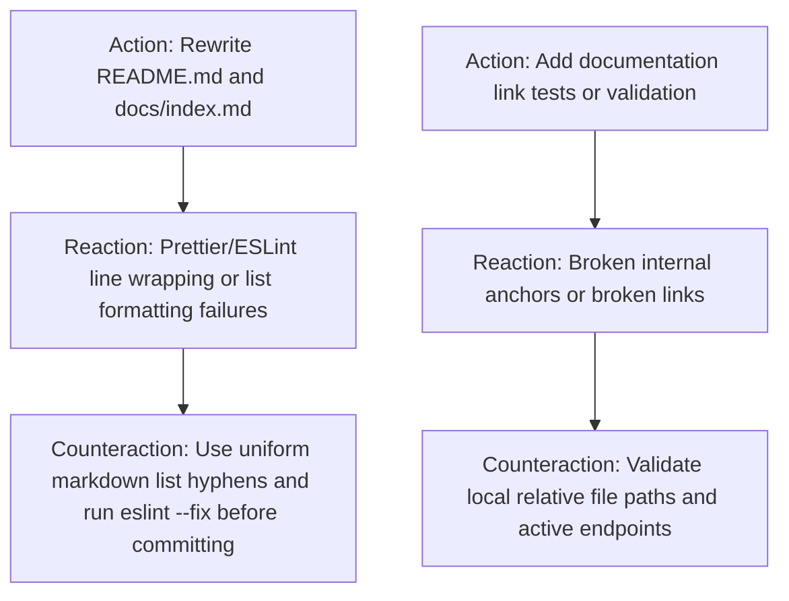

# ARC Probing — Mission CLEAN-4: Root README & Technical Architecture Documentation Overhaul

**Mission:** `CLEAN-4`  
**Governing Authority:** `DATA-MODEL-AUTHORITY.md`  
**Required Evidence Stage:** `CANONICAL`  
**Assigned Lane:** `lane_docs`  

---

## 1. Forensic Intake & Claim Framing

### 1.1 Claims Under Test
* **Claim C1 (Platform Root Documentation):** Root `README.md` comprehensively documents both competitive paper trading and the Stock Royale battle-royale mode, monorepo architecture, development quickstart (`pnpm install`, `pnpm dev`), test execution (`pnpm test`), Tauri 2.0 / Steam Deck packaging commands (`pnpm desktop:dev`, `pnpm desktop:build`), environment variable configuration (`.env.example`), interactive Swagger/OpenAPI documentation (`http://localhost:3332/docs`), and project structure.
* **Claim C2 (Jekyll & Monorepo Design Docs Overhaul):** `docs/index.md` provides complete backend (FastAPI, Python 3.11+, in-memory 10 Hz market simulator, PostgreSQL/SQLite) and frontend (Vue 3, TypeScript, Vite, Naive UI, UnoCSS, Tauri 2.0) architectural rationales, eliminating all legacy `// todo` placeholders.
* **Claim C3 (Integrity & Lint Compliance):** Markdown formatting conforms strictly to Prettier/ESLint rules (`pnpm run lint`), programmatic blast radius is strictly verified via native Nx graph, and monorepo tests (`pnpm test`) pass with zero regressions.

---

## 2. Action–Reaction–Counteraction (ARC) Analysis

---

## 3. Harness Fidelity & Verification Controls

### 3.1 Positive Control (Feature & Architecture Completeness)
* Probe: Assert `README.md` documents "Stock Royale", "Paper Trading", "Tauri 2.0", "FastAPI", "pnpm dev", "pnpm test", "pnpm desktop:dev".
* Expected: All sections present and consistent with monorepo scripts.

### 3.2 Negative Control (Legacy Stale Content & Placeholder Removal)
* Probe: Assert `docs/index.md` contains zero `// todo` placeholder strings.
* Expected: Exact match count = 0.

---

## 4. Rollback & Pre-conditions
* **Pre-conditions:** `CLEAN-3` completed at `9cd89f7`.
* **Rollback Plan:** `git checkout -- README.md docs/index.md`
* **Point of No Return:** None.
