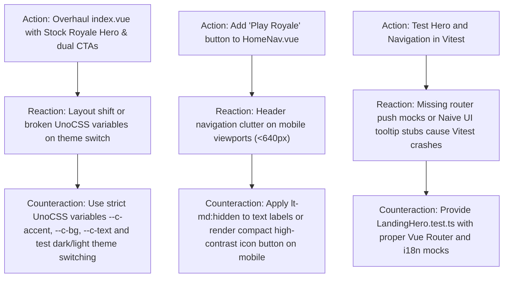

# ARC Probing — Mission LANDING-1: Hero Arena, Value Proposition & Dual Conversion CTAs

**Mission:** `LANDING-1`  
**Governing Authority:** `DATA-MODEL-AUTHORITY.md`  
**Required Evidence Stage:** `CANONICAL` (with `ACTIVATION` floor)  
**Assigned Lane:** `lane_landing_ui`  
**Flow Claim:** `FLOW-LANDING-CONVERSION`  

---

## 1. Forensic Intake & Claim Framing

### 1.1 Claims Under Test
* **Claim C1 (High-Impact Hero Visuals):** Replacing the sparse placeholder on `/` (`packages/client/src/pages/index.vue`) with a battle-royale hero header ("The 60-Player Stock Market Battle Royale"), live status chips ("Season 1: Liquidity Drain Active", "60 Traders Per Match", "100ms Fast Match Engine"), and simulated market ticker delivers instant visual engagement and converts visitors.
* **Claim C2 (Dual Direct Conversion CTAs):** Adding high-contrast primary CTA ("Deploy to Stock Royale" -> `/dashboard/royale`) and secondary CTA ("Sign In / Register" -> `/login`) eliminates visitor dead-ends and funnels users into active match queue or authentication.
* **Claim C3 (Home Header Action Integration):** Upgrading `packages/client/src/components/navigation/HomeNav.vue` with a highlighted "Play Royale" action button provides persistent top-level navigation to the battle royale arena from anywhere on the landing page.
* **Claim C4 (Design System & Mobile Responsiveness):** Using UnoCSS responsive classes (`lt-md:`, `flex-col`, `gap-4`) and Naive UI styling ensures zero visual overflow on small mobile screens (320px) up to ultra-wide displays.

---

## 2. Action–Reaction–Counteraction (ARC) Analysis

---

## 3. Harness Fidelity & Verification Controls

### 3.1 Positive Control (Component Mount & Element Presence)
* **Probe:** Mount `packages/client/src/pages/index.vue` and `packages/client/src/components/navigation/HomeNav.vue` in Vitest.
* **Expected:** Assert presence of headline text, live status chips, CTA button routes (`/dashboard/royale`, `/login`), and ticker elements.

### 3.2 Negative Control (Missing Translation Key Resilience)
* **Probe:** Render with fallback i18n mock; verify no undefined string rendering or missing DOM containers.

---

## 4. Rollback & Pre-conditions
* **Pre-conditions:** `CLEAN-4` completed at canonical stage; `pnpm --filter client test` passing 100%.
* **Rollback Plan:** `git checkout -- packages/client/`
* **Point of No Return:** None (additive and refactored client UI).
